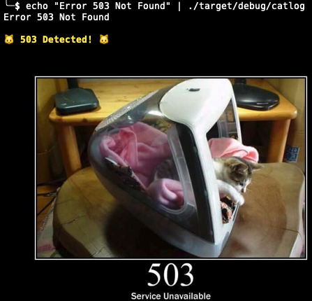

# http-catlog

[](https://crates.io/crates/http-catlog)
[](https://crates.io/crates/http-catlog)
[](https://github.com/Justhiro55/catlog/actions)
[](LICENSE)
[](https://www.rust-lang.org/)

> Monitor logs and display cat images when HTTP errors are detected 🐱

Watch your logs and get adorable cat images from [http.cat](https://http.cat) displayed right in your terminal whenever HTTP error status codes are detected.

<p align="center">
  
</p>

## Installation

### Using Cargo

```bash
cargo install http-catlog
```

### From source

```bash
git clone https://github.com/Justhiro55/catlog
cd catlog
cargo install --path .
```

## Usage

### Pipe mode
```bash
tail -f /var/log/nginx/access.log | catlog
```

### File watch mode
```bash
catlog -f /var/log/app.log
```

### Command execution mode
```bash
catlog -e "tail -f /var/log/app.log"
```

## Options

```bash
catlog [OPTIONS]
```

- `-f, --follow <FILE>` - Follow a file (like tail -f)
- `-e, --exec <COMMAND>` - Execute a command and monitor its output
- `--size <N>` - Image width in terminal characters (default: 60)
- `--no-image` - Don't display images (text only)
- `--all` - Show cats for all status codes
- `--status <CODES>` - Comma-separated list of specific status codes
- `-h, --help` - Print help
- `-V, --version` - Print version

## Examples

**Monitor nginx access logs:**
```bash
tail -f /var/log/nginx/access.log | catlog
```

**Watch application logs:**
```bash
catlog -f app.log
```

**Monitor with specific status codes only:**
```bash
echo "Error 404 Not Found" | catlog --status 404,503
```

**Execute command and monitor:**
```bash
catlog -e "docker logs -f mycontainer"
```

**Text-only mode (no images):**
```bash
tail -f /var/log/app.log | catlog --no-image
```

**Show cats for all HTTP status codes:**
```bash
catlog -f app.log --all
```

## Terminal Compatibility

Image display has been tested on terminals like iTerm2 and Kitty, but has not been fully verified on other terminals. Image quality may vary depending on your terminal emulator's capabilities.

## License

Licensed under either of MIT or Apache-2.0 at your option. See [LICENSE](LICENSE) for details.

## Credits

Cat images are provided by [https://http.cat](https://http.cat).
